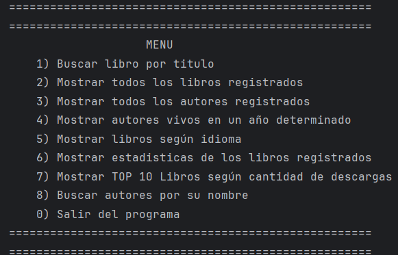
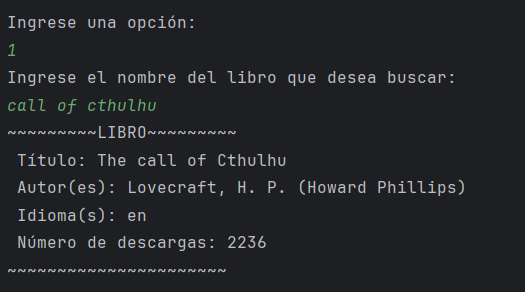
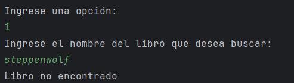
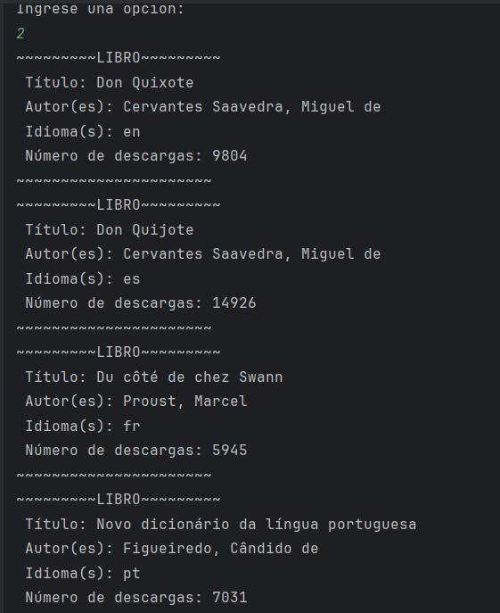
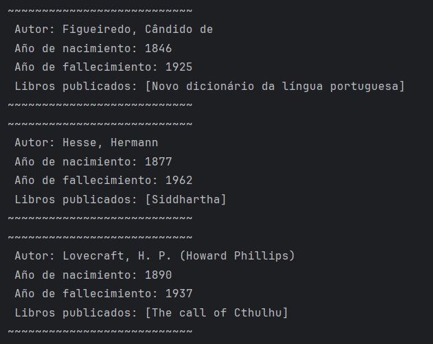
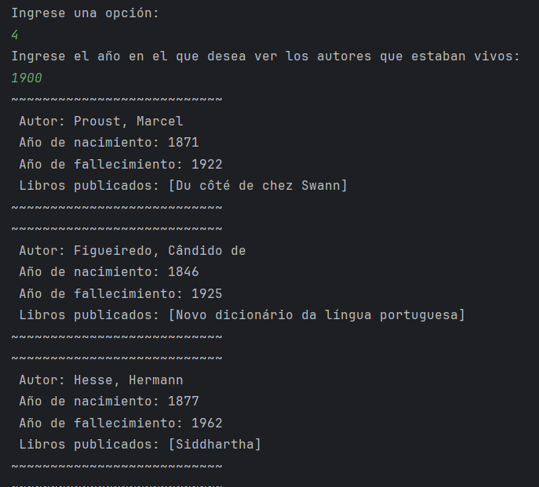
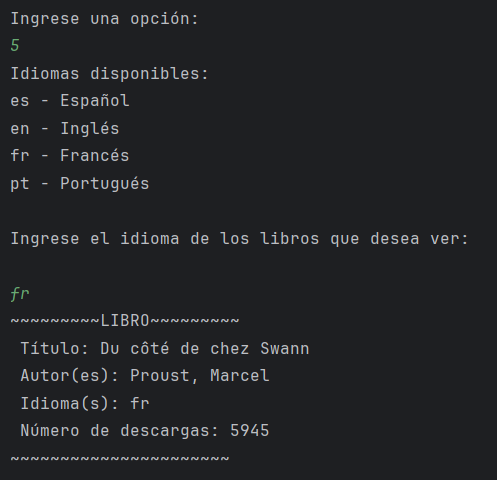
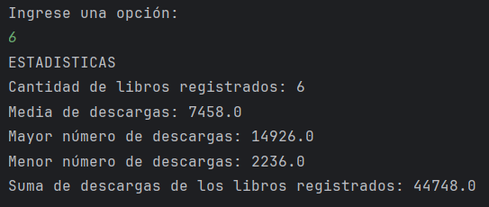
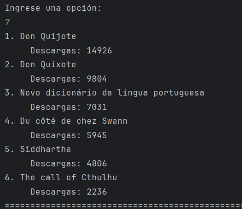
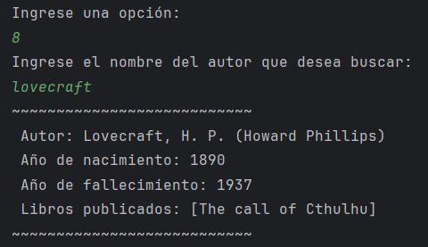

<h1 align="center"> Challenge Literalura</h1>

Este proyecto consiste en un catalogo de libros implementado en Java, y es mi solución al desafío propuesto por el bootcamp Oracle Next Education impartido por Alura Latam en su formación de desarrollo back-end.

---
## Características del sistema

* Interacción con el usuario mediante una interfaz en la linea de comandos 
* Búsqueda de libros por título.
* Persistencia de datos: Cada búsqueda registra el libro encontrado y sus autores en una base de datos local.
* Listar libros y autores registrados
* Búsqueda de autores que estuvieron vivos en un año especifico.
* Listar los libros registrados en el sistema según un idioma.
* Listar los 10 libros más descargados.
* Genera datos estadisticos según la cantidad de descargas de los libros registrados.
---
## Tecnologías

* Spring Boot
* Spring Data JPA
* PostgreSQL
* Para las consultas de libros se utilizó la API [Gutendex](https://gutendex.com/)

---

## Demostración de uso

* Menú principal

    

---

* Al seleccionar **"1) Buscar libro por título"** el usuario ingresa el nombre del libro que desea buscar, y este se registra en la base de datos.

    

* Si se ingresa un libro que no se encuentra en la biblioteca Gutendex, se arroja el siguiente error:

    

---

* Al seleccionar **"2) Mostrar todos los libros registrados"** se imprimen en la consola todos los libros que han sido registrados en la base de datos.

    

---

* Al seleccionar **"3) Mostrar todos los autores registrados"** se imprimen en la consola todos los autores que han sido registrados en la base de datos.

    

---

* Al seleccionar **"4) Mostrar autores vivos en un determinado año"** el usuario ingresa un año en específico, y en consola se imprimen todos los autores que estuvieron (o están) vivos durante ese año. 

    

---

* Al seleccionar **"5) Mostrar libros según idioma "** el usuario ingresa alguno de los identificadores de idioma disponibles, y en consola se imprimen todos los libros que se encuentran en ese idioma.

    

---

* Al seleccionar **"6) Mostrar estadísticas de los libros registrados"** se imprimen datos estadísticos referente a la cantidad de descargas de los libros registrados en la base de datos.

    

---

* Al seleccionar **"7) Mostrar TOP 10 Libros según cantidad de descargas"** se imprimen los 10 libros más descargados dentro de la base de datos.

    

---

* Al seleccionar **"8) Buscar autores por su nombre "** el usuario ingresa el nombre de un autor, y el sistema busca en la base de datos todos los autores que tengan ese nombre. 

    

---